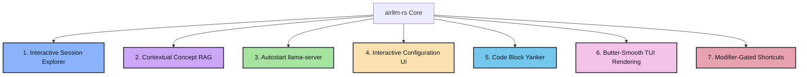
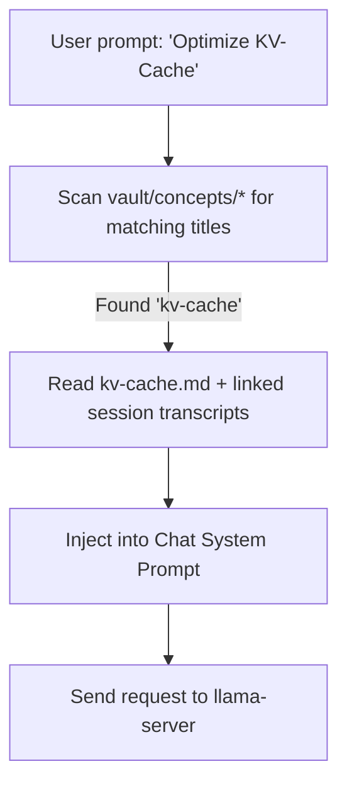

# Proposal: Next-Gen Features for airllm-rs

This document outlines five premium, highly practical features we can add to the `airllm-rs` terminal application. These features will transition the project from a simple TUI client into a powerful, interactive, and autonomous local knowledge workstation.

---

## 🗺️ Feature Roadmap Overview



---

## 1. 📂 Interactive Session Explorer & Chat Resumption
> [!NOTE]
> **Current Limitation**: The right-hand "Memory" pane is read-only, showing a flat list of recent sessions and concepts. You cannot view old transcripts or continue an old chat session.

### Proposed Improvement
1. **Interactive Pane Selection**: Pressing `Tab` to focus on the `Memory` pane enables a selectable list mode.
2. **Details Pop-up**: Selecting a Session node with `Up`/`Down` and pressing `Enter` opens a gorgeous centered modal containing the session's summary, key concepts, and its complete markdown transcript.
3. **Session Resumption**: Pressing `r` inside the session explorer loads that past session's messages directly into the active chat session. New chat messages are appended to the *same* markdown note in your Obsidian vault, keeping the knowledge graph integrated.

### UI Mockup (Centered Modal)
```
┌───────────────────────────────── Chat ─────────────────────────────────┐
│                                                                        │
│  ┌──────────────────── Session: 2026-05-03-143022 ───────────────────┐  │
│  │ Date: 2026-05-03 14:30                                            │  │
│  │ Model: gemma-4-31b                                                │  │
│  │ Concepts: [[attention-mechanism]], [[kv-cache]]                   │  │
│  │ ───────────────────────────────────────────────────────────────── │  │
│  │ ## Summary                                                        │  │
│  │ Discussed how the attention mechanism works in transformer       │  │
│  │ models and the role of key-value (KV) caching.                    │  │
│  │                                                                   │  │
│  │ ## Transcript                                                     │  │
│  │ You: How does attention work?                                     │  │
│  │ Gemma: Attention weights tokens based on query-key similarity...  │  │
│  │                                                                   │  │
│  │ [Esc]: Close | [r]: Resume Chat | [↑/↓]: Scroll                   │  │
│  └───────────────────────────────────────────────────────────────────┘  │
│                                                                        │
└────────────────────────────────────────────────────────────────────────┘
```

---

## 2. 🧠 Contextual Concept RAG (Retrieval-Augmented Generation)
> [!IMPORTANT]
> **Current Limitation**: The system builds system context by loading the `N` most recent sessions. If you ask about a concept discussed 2 weeks ago (outside the top `N`), the model will have completely forgotten it.

### Proposed Improvement
Implement a lightweight **Concept-matching RAG engine**:
1. When you type a new prompt (e.g., *"How do we optimize our KV Cache?"*), the system parses the prompt for tokens matching any known concepts in your `vault/concepts/` directory.
2. If a match (e.g. `kv-cache`) is found:
   - It reads `vault/concepts/kv-cache.md` to extract the concept description.
   - It pulls the transcripts of all sessions linked to `kv-cache` (e.g. `sessions/2026-05-03-143022.md`).
3. This highly relevant context is dynamically injected into the system prompt of the current session, guaranteeing semantic recall across years of chat logs without inflating context length with irrelevant history.



---

## 3. 🚀 Zero-Config `llama-server` Subprocess Management
> [!TIP]
> **Current Limitation**: You must manually locate `llama-server.exe`, open another terminal tab, type out a long, complex command with CUDA and layer offload flags, and keep it running in the background.

### Proposed Improvement
Make `airllm` a truly unified binary:
1. On startup, the Rust binary performs an HTTP health check on port `8081`.
2. If the port is unresponsive, it searches for a `llama-server` binary in the PATH or the directory containing the model.
3. It spawns the server in a separate background process, auto-detecting system specs:
   - Auto-setting `-ngl` (number of GPU layers) based on available VRAM (using `sysinfo` or calling `nvidia-smi` internally).
   - Passing context size and model paths from `config.toml`.
4. The TUI displays a beautiful progress bar or loading spinner while the model warms up.
5. On exit (`q` or `Ctrl+C`), it gracefully terminates the child process.

---

## 4. ⚙️ Interactive Configuration & Settings UI
> [!TIP]
> **Current Limitation**: To change the model file path, Obsidian vault folder, or the context size, you must close the application, open a text editor, and modify `%APPDATA%\airllm\config.toml` manually.

### Proposed Improvement
Add a fully interactive configuration screen toggled by pressing `c` (when not in input focus) or a new `airllm config --edit` subcommand:
- A custom form widget in `ratatui` allowing you to select and modify settings:
  - **GGUF Model Path** (with a simple directory browser to select files)
  - **Obsidian Vault Directory**
  - **Max Context Nodes** (numeric input)
  - **Default Persona / System Instruction**
  - **Fast/Deep Temperature Defaults**
- Config validation checks paths before writing to disk, preventing runtime crashes.

---

## 5. 📋 Code Block Yanker (Clipboard Manager)
> [!NOTE]
> **Current Limitation**: While you can copy text from a terminal, selecting multiline code blocks correctly across margins, scrolls, and line wraps is a major pain.

### Proposed Improvement
Integrate robust clipboard handling:
1. **Interactive Extraction**: Pressing `Ctrl+Y` scans the most recent assistant response for Markdown code blocks (e.g. blocks surrounded by \`\`\`).
2. **Selection Modal**: It opens a small menu showing all detected code blocks with their respective language tags (e.g., `[1] Rust (12 lines)`, `[2] Python (4 lines)`).
3. **Instant Copy**: Pressing the number key or selecting a block with `Enter` copies it to the system clipboard using the existing `arboard` dependency, showing a brief "Code block copied to clipboard!" message in the status bar.

---

## 6. ⚡ Butter-Smooth TUI Rendering & Non-Blocking Threads
> [!TIP]
> **Proposed Enhancement**: File operations (like loading vault sessions or scanning concepts) and token reading from streams should run in non-blocking environments to guarantee that the UI draw cycle never stutters.

### Proposed Improvement
1. **Async Filesystem Operations**: Offload all markdown loading, directory scanning, and vault queries to separate `tokio` blocking threads (`tokio::task::spawn_blocking`), passing results back to the main thread via async channels.
2. **State-Driven Redrawing**: Throttle ratatui draws to a maximum of 60 frames per second (or draw ONLY when the chat state, input box cursor, or scroll position actually changes).
3. **Smooth Token Buffer**: Implement a minor token smoothing buffer. Instead of printing incoming tokens raw instantly which causes blocky leaps in word wrapping, stream them out character-by-character on a microsecond timer for a highly premium "teletype typewriter" aesthetic.

---

## 7. ⌨️ Modifier-Gated Shortcuts (Prevent Accidental Action)
> [!WARNING]
> **Proposed Enhancement**: Single-key triggers (like pressing `q` to quit or `m` to toggle mode) are extremely sensitive. While typing or scrolling the graph, a single mistyped key can instantly kill the application or toggle thinking modes.

### Proposed Improvement
1. **Gated Modifiers**: Remove all naked single-letter critical bindings in the main view.
   - Replace `q` (Quit) with `Ctrl+Q` (or keep both `Ctrl+Q` and `Ctrl+C`).
   - Replace `m` (Toggle Thinking Mode) with `Ctrl+M`.
2. **Accidental Termination Block**: When exiting the TUI via `Ctrl+Q` or `Ctrl+C`, if a chat session is active, verify options before closing or show a clean exit confirm dialogue.
3. **Focus Isolation**: In modal views, single-key scroll navigation (`Up`/`Down`) will still function, but critical actions will strictly require gated control keys.

---

## 🛠️ Proposed File Modifications

To implement these features, we would adjust the following parts of the codebase:

1. **`src/tui/app.rs`**:
   - Add state variables: `selected_concept`, `selected_session`, `active_modal`, `detected_code_blocks`.
   - Update keyboard event handlers to intercept keys in focus modes.
2. **`src/tui/layout.rs`**:
   - Add a modal rendering layer to draw pop-up boxes for session viewers, config forms, and clipboard menus.
3. **`src/backend/process.rs`**:
   - Add subprocess monitoring logic to track the state of the child `llama-server` process.
4. **`src/memory/graph.rs`**:
   - Enhance the graph search index to support quick keyword lookup.
5. **`src/tui/mod.rs`**:
   - Update crossterm keybindings to transition `q` and `m` triggers into modifier-gated combinations `Ctrl+Q` and `Ctrl+M`.
